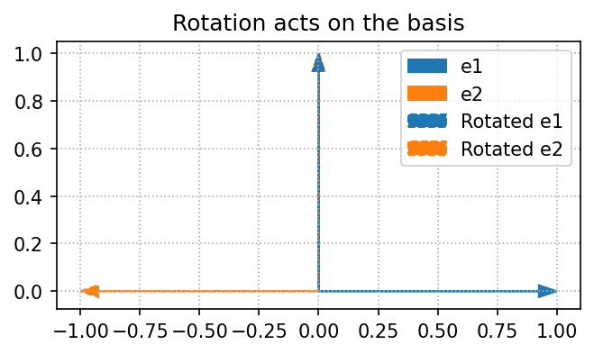
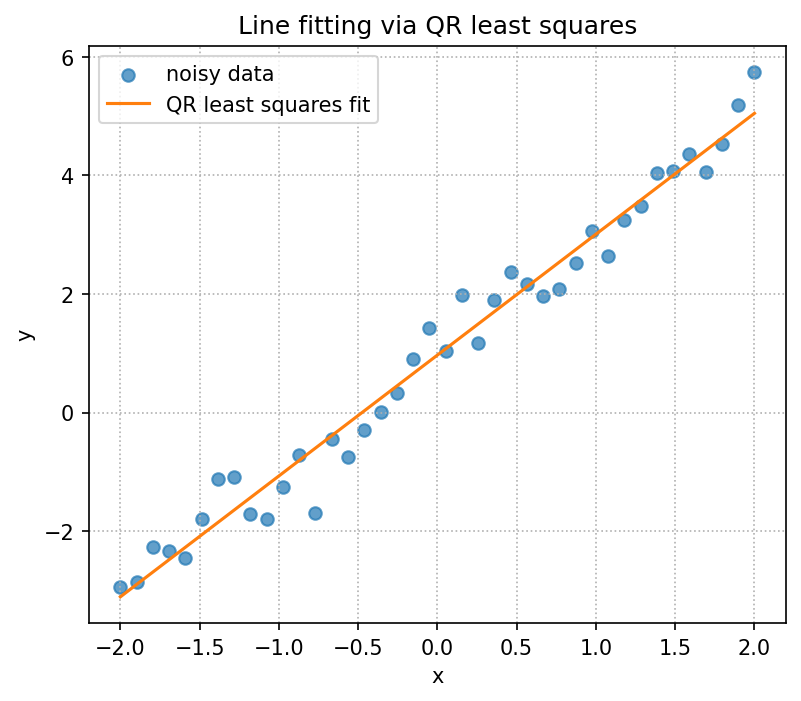
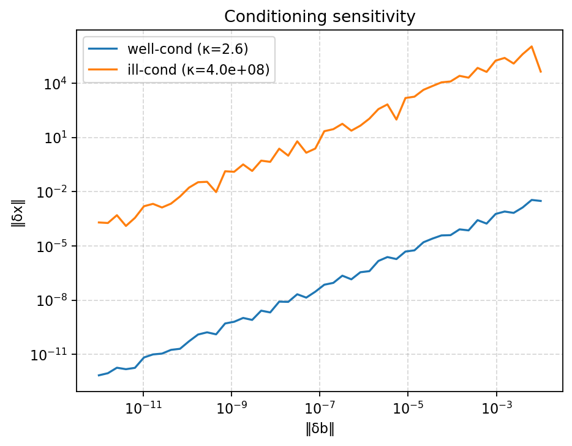

# linear-algebra-with-python


Intuition-first lessons, reference implementations, and reproducible demos for linear algebra with NumPy.

## Learning path
| Module | Notebook | Outcome |
| --- | --- | --- |
| 01 | `notebooks/01_vectors.ipynb` | Vector operations, Gram-Schmidt, and projections in `src/linalg_with_python/vectors.py`. |
| 02 | `notebooks/02_matrices_and_linear_maps.ipynb` | Matrices as maps—basis, unit shapes, and geometric examples saved via `scripts/demo_linear_maps.py`. |
| 03 | `notebooks/03_solving_linear_systems.ipynb` | Solving `Ax = b`, residuals, and conditioning along with `scripts/demo_conditioning.py`. |
| 04 | `notebooks/04_least_squares_and_projections.ipynb` | Column space, least squares, and QR vs normal equations using `src/linalg_with_python/least_squares.py`. |
| 05 | `notebooks/05_qr_and_svd.ipynb` | QR and SVD intuition, singular-value stretches, and reconstruction checks. |
| 06 | `notebooks/06_eigenvalues_and_diagonalization.ipynb` | Eigengeometry, Rayleigh quotients, and power iteration examples. |
| 07 | `notebooks/07_pca_mini_project.ipynb` | PCA mini-project with covariance, SVD, and projection visualization; supported by `scripts/demo_pca_2d.py`. |

## Featured figures




## Setup & validation
```bash
poetry install
poetry run pytest -q
poetry run ruff check .
poetry run mypy src
```

## Running demos
```bash
python scripts/demo_linear_maps.py
python scripts/demo_least_squares.py
python scripts/demo_eigen_2d.py
python scripts/demo_conditioning.py
python scripts/demo_pca_2d.py
```

Each demo saves its figures under `assets/figures/` so notebooks and documentation can reference them.

## CLI helpers
`poetry run linalgpy --help` shows the available commands. Some examples:

```bash
poetry run linalgpy map --A "1.2,0.8;0,0.9"
poetry run linalgpy solve --A "3,1;1,2" --b "9,8"
poetry run linalgpy lsq --xdata "0,1,2" --ydata "1,2,3"
```

CLI arguments use comma-separated values for rows and semicolons between rows; keep the inputs numeric so the parser stays simple.

## Documentation
- `CONTRIBUTING.md` explains the workflow for tests, notebooks, and CLI helpers.
- `docs/syllabus.md` lays out the module order, exercises, and supporting modules.
- `docs/faq.md` lists frequent issues with tests, notebooks, and the CLI.
- `CHANGELOG.md` tracks notable updates.
- `CODE_OF_CONDUCT.md` and `SECURITY.md` describe contributor expectations and reporting.

## License
MIT.
